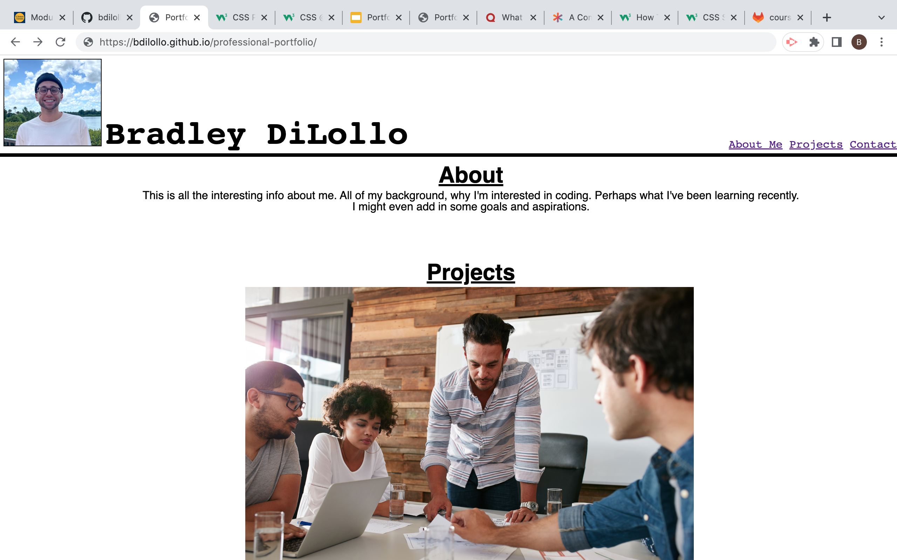

# Professional Portfolio

[Click here for deployed application](https://bdilollo.github.io/professional-portfolio/)

## Description
This project represents my first attempt at building a page from scratch. I've constructed the beginnings of a professional portfolio, showcasing both myself and (eventually) my work for potential employers and other developers. It currently demonstrates basic functionality, with live links and a viewport-responsive layout. Overall, it offers a snapshot of my current comfort and skill level with both HTML and CSS (which is to say, still learning), and also provides the framework for future development as my abilities grow.

---

## Screenshot

---

## Contact
[LinkedIn](https://www.linkedin.com/in/bradley-dilollo/)  
[GitHub](https://github.com/bdilollo)

---

## License
[MIT](/LICENSE.txt) &#124; 2022 &#124; Bradley DiLollo

